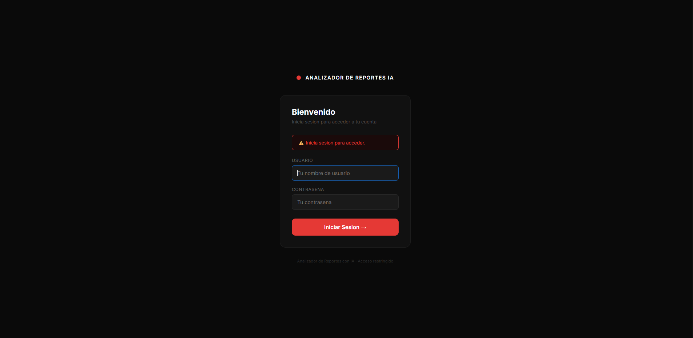

# 📊 Analizador de Reportes con IA

Aplicación web que permite a empresas subir archivos Excel o CSV y obtener automáticamente reportes ejecutivos en español generados por inteligencia artificial, con visualización de datos, exportación a PDF e historial de análisis por usuario.


---

## 🖥️ Demo

### Inicio de sesión


### Interfaz principal


### Análisis con gráfica y reporte de IA


### Historial de análisis anteriores


### Panel de administrador


---

## ✨ Funcionalidades

- **Carga de archivos** — Drag & drop de archivos Excel (.xlsx, .xls) y CSV hasta 15MB
- **Análisis automático con Pandas** — Estadísticas por columna numérica: promedio, máximo, mínimo y total
- **Reporte ejecutivo con IA** — Groq + LLaMA 3.1 genera resumen ejecutivo, hallazgos clave, tendencias y recomendaciones en español
- **Soporte multi-hoja** — Elige qué hoja analizar o analiza todas en conjunto con pd.concat()
- **Visualización de datos** — Gráficas de barras interactivas con Chart.js
- **Exportación a PDF** — Reporte profesional con estadísticas, gráfica e insights descargable
- **Historial por usuario** — Cada usuario ve solo sus análisis anteriores con acordeón expandible
- **Autenticación multi-usuario** — Login seguro con Flask-Login y contraseñas encriptadas con Bcrypt
- **Panel de administrador** — Métricas de uso, gestión de usuarios y actividad reciente

---

## 🛠️ Stack tecnológico

| Capa | Tecnología |
|------|-----------|
| Backend | Python 3.11 + Flask |
| IA | Groq API + LLaMA 3.1 8B Instant |
| Datos | Pandas + OpenPyXL |
| PDF | ReportLab |
| Auth | Flask-Login + Flask-Bcrypt |
| Base de datos | SQLite |
| Frontend | HTML + CSS + JavaScript vanilla |
| Gráficas | Chart.js (CDN) |
| Deploy | Railway / Gunicorn |

---

## 🚀 Instalación local

### Requisitos previos
- Python 3.11
- Miniconda o Anaconda
- Cuenta en [Groq Cloud](https://console.groq.com) para obtener tu API key

### 1. Clona el repositorio

```bash
git clone https://github.com/Nihilus-tech/Analizador-reportes-IA.git
cd Analizador-reportes-IA
```

### 2. Crea y activa el entorno Conda

```bash
conda create -n analizador_reportes_ia python=3.11
conda activate analizador_reportes_ia
```

### 3. Instala las dependencias

```bash
pip install -r requirements.txt
```

### 4. Configura las variables de entorno

Copia el archivo de ejemplo y rellena tus valores:

```bash
cp .env.example .env
```

Edita `.env` con tus datos:

```env
GROQ_API_KEY=tu_api_key_de_groq_aqui
SECRET_KEY=una_clave_secreta_larga_y_random
UPLOAD_FOLDER=uploads
REPORTS_FOLDER=reports
```

### 5. Ejecuta la aplicación

```bash
python -m flask run
```

Abre tu navegador en `http://127.0.0.1:5000`

### 6. Credenciales iniciales

Al iniciar por primera vez se crea automáticamente el usuario administrador:

```
Usuario: admin
Contraseña: admin1234
```

> ⚠️ Cambia la contraseña del admin desde el Panel de Administrador antes de usar en producción.

---

## 📁 Estructura del proyecto

```
analizador-reportes-ia/
│
├── app.py                      # Núcleo Flask — rutas y lógica principal
├── requirements.txt            # Dependencias del proyecto
├── .env.example                # Ejemplo de variables de entorno
├── Procfile                    # Configuración para Railway
│
├── modules/
│   ├── analyzer.py             # Análisis de datos con Pandas
│   ├── ai_engine.py            # Generación de insights con Groq + LLaMA
│   ├── pdf_generator.py        # Exportación a PDF con ReportLab
│   ├── historial.py            # Historial de análisis por usuario
│   └── database.py             # Gestión de usuarios con SQLite
│
├── templates/
│   ├── index.html              # Interfaz principal
│   ├── login.html              # Página de inicio de sesión
│   └── admin.html              # Panel de administrador
│
├── screenshots/                # Capturas de pantalla del proyecto
│
├── uploads/                    # Archivos subidos (ignorado por git)
└── reports/                    # PDFs, historial JSON y base de datos
```

---

## 🔐 Sistema de autenticación

- **Admin** — Acceso completo: analizador + panel de administración + métricas globales
- **Usuario** — Acceso solo al analizador y su propio historial

El admin crea las cuentas manualmente desde el panel. No hay registro público.

---

## 📊 Tipos de archivos soportados

| Formato | Extensión | Multi-hoja |
|---------|-----------|-----------|
| Excel moderno | .xlsx | ✅ |
| Excel legacy | .xls | ✅ |
| CSV | .csv | — |

**Límite de tamaño:** 15MB por archivo

---

## 🔗 Proyectos relacionados

- [agente-ventas-ia](https://github.com/Nihilus-code/agente-ventas-ia) — Agente RAG de ventas con Flask, LangChain y ChromaDB

---

## 📄 Licencia

MIT License — libre para uso personal y comercial.

---

**Desarrollado por [Nihilus](https://github.com/Nihilus-code)**
